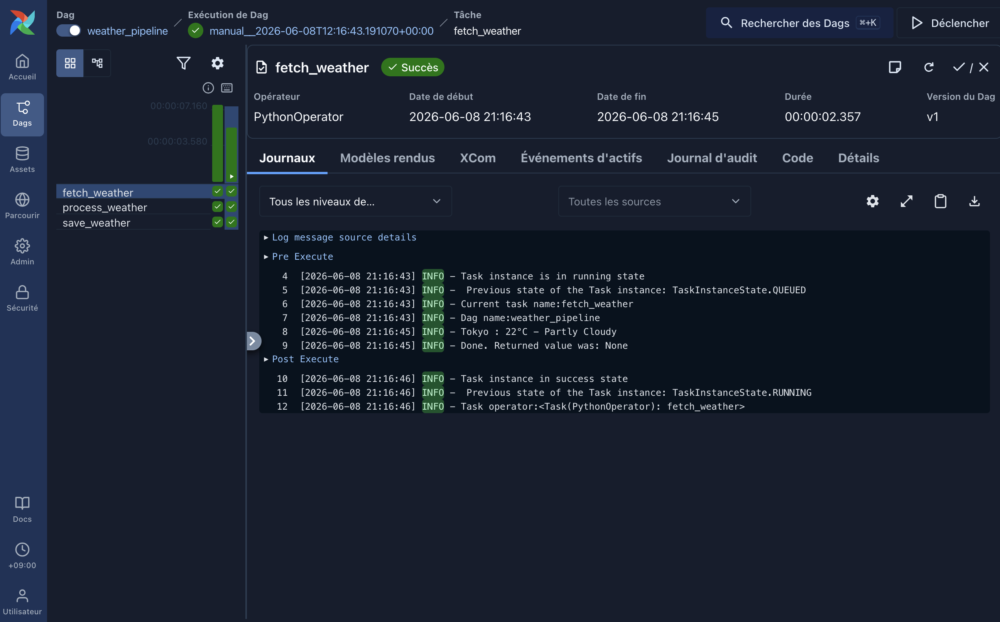
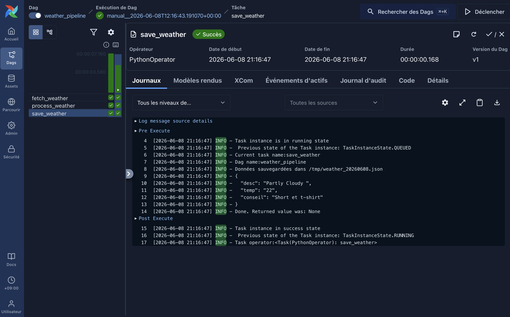
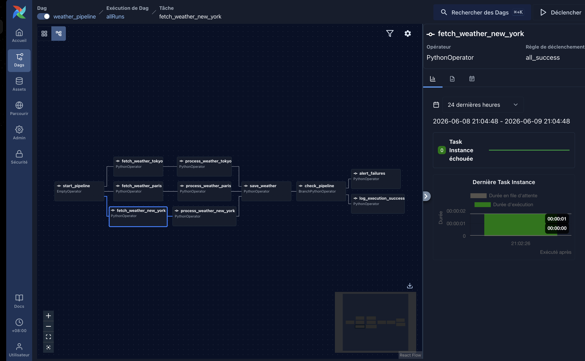

# Airflow Weather Pipeline

Environnement Airflow local avec Docker Compose.

## Prérequis

- Docker
- Docker Compose

## Lancer l'environnement

```bash
# Initialiser airflow
docker compose up airflow-init

# Démarrer airflow
docker compose up -d

# Arrêter airflow
docker compose down
```

## Accès

- **UI** : http://localhost:8080
- **Login** : `airflow` / `airflow`

## DAGs disponibles

| DAG | Description | Schedule |
|-----|-------------|----------|
| `weather_pipeline` | Fetch la météo de Paris, Tokyo et New York via Open-Meteo | `@daily` |

## Commandes utiles

```bash
# Lister les DAGs
docker compose exec airflow-apiserver airflow dags list

# Déclencher un DAG manuellement
docker compose exec airflow-apiserver airflow dags trigger weather_pipeline

# Voir les logs d'un service
docker compose logs -f airflow-scheduler
```

## Résultats / Réponses aux question

Les résultats sont disponbiles dans /images.

### Analyse des logs.



Ici, on voit que la météo de Tokyo a été récupérée avec succès. 22 Degrés Celsius et Partly Cloudy.



Ici, on voit que la météo a été traitée avec succès. Short et t-shirt et que les données ont été sauvegardées avec succès.

### Explication des tâches

Le pipeline récupère la météo de 3 villes via l'API [Open-Meteo](https://open-meteo.com/) (gratuite, sans clé API) : **Paris, Tokyo, New York**. Les tâches sont créées automatiquement pour chaque ville grâce à une boucle sur le dictionnaire `CITIES`.



- **`start_pipeline`**: point d'entrée. Sans lui, les 3 fetch démarreraient sans lien visible entre eux dans l'UI Airflow.

- **`fetch_weather_{city}`**: appelle l'API Open-Meteo et stocke le JSON brut dans XCom sans le modifier. Séparé du traitement pour pouvoir rejouer uniquement l'appel API en cas de panne, sans tout re-exécuter.

- **`process_weather_{city}`**: extrait les champs utiles (`temperature_c`, `humidity_pct`, `wind_speed_kmh`, `weather_code`, `fetched_at`) et valide que tous sont présents. Si un champ manque, la tâche échoue plutôt que de laisser passer des données incomplètes.

- **`save_weather`**: Récupère les données traitées des 3 villes et les sauvegarde dans un fichier `/tmp/weather_pipeline/YYYY-MM-DD.json`. J'ai décidé de mettre un fichier pour plus de simplicité mais j'aurais pu mettre 3 fichiers différents pour chaque ville et classer par dossier (date/nom_ville)

- **`check_pipeline`**: vérifie que toutes les villes ont bien été traitées.

- **`log_execution_success`**: log un message de succès avec le chemin du fichier produit. Permet de tracer les erreurs dans les logs Airflow.

- **`alert_failures`**: log les villes qui ont échoué. Dans un vrai projet, cette tâche enverrait une alerte (email, Slack…) pour notifier l'équipe.